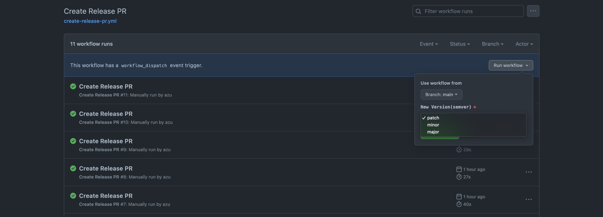

# monorepo + lerna + GitHub Release's [Automatically generated release notes](https://docs.github.com/en/repositories/releasing-projects-on-github/automatically-generated-release-notes)

This example monorepo show release flow with [lerna](https://github.com/lerna/lerna) + GitHub Release's [Automatically generated release notes](https://docs.github.com/en/repositories/releasing-projects-on-github/automatically-generated-release-notes)

## Pattern A: Review Release PR and Publish via CI

UseCase:

- Review Release Note before publishing
- Publish from CI

Steps:

1. Create Release PR via dispatching [.github/workflows/create-release-pr.yml](https://github.com/azu/monorepo-github-releases/actions/workflows/create-release-pr.yml)
   - You can select new version with semver(patch,minor,major)
   - 
2. [CI] Create Release PR
   - Update `lerna.json`'s `version` and `packages/*/package.json`'s `version`
   - Fill the Pull Request body with [Automatically generated release notes](https://docs.github.com/en/repositories/releasing-projects-on-github/automatically-generated-release-notes)
   - e.g. https://github.com/azu/monorepo-github-releases/pull/18
3. Review Release PR
    - You can modify PR body
4. Merge Release PR
5. [CI] Publish new version to npm and GitHub Release
    - GitHub Release body is filled with PR body
    - e.g. https://github.com/azu/monorepo-github-releases/releases/tag/v1.6.3

> **Warning**
> If Publish is failed, you can re-run the workflow, or You can move to Pattern A-5.

## Pattern A-5: Just Publish from CI 

Pattern A's step 5 is failed in sometimes because npm registry is down or some package is broken.

You can re-publish it manually, but you can use CI for re-publishing.

UseCase:

- Retry to publish if failed

Steps:

0. [Optional] You can commit to fix broken packages
1. Dispatch [.github/workflows/release.yml](https://github.com/azu/monorepo-github-releases/actions/workflows/release.yml) workflow
2. [CI] Publish new version to npm and GitHub Release if not published yet
   - The release note content is [Automatically generated release notes](https://docs.github.com/en/repositories/releasing-projects-on-github/automatically-generated-release-notes) by default

> **Warning**
> This manual workflow requires updating version before executing.  
> So, Most use-cause is for retrying to publish if failed on Pattern A.  
> If you want to fix something, It is preferable to start again from A.

> **Note**
> No matter how many times this workflow is executed, the result is the same.
> - No publish if packages are already published
> - No add tag if git tag is added
> - Overwrite release note if GitHub Release is already created

## Pattern B: Publish from Local

UseCase:

- Just Publish from Local

You can just run following command:

    npm run versionup && npm run release && gh release create --generate-notes "$(git describe --tags --abbrev=0)"

1. Update `lerna.json`'s `version` and `packages/*/package.json`'s `version`
2. Publish to npm
3. Create Release Note on GitHub Releases

## Changelog

See [Releases page](https://github.com/azu/monorepo-sandbox/releases).

## Develop

This monorepo uses GitHUb Packages Registry.

npm package name link to repository owner on GitHUb Packages Registry.

So, You need to change each `packages/*/package.json` after fork this repository.

- name: `@{you}/<name>`
- repository.url: "https://github.com/{you}/monorepo-github-releases.git"

## Contributing

Pull requests and stars are always welcome.

1. Fork it!
2. Create your feature branch: `git checkout -b my-new-feature`
3. Commit your changes: `git commit -am 'Add some feature'`
4. Push to the branch: `git push origin my-new-feature`
5. Submit a pull request :D

## Author

- [github/azu](https://github.com/azu)
- [twitter/azu_re](https://twitter.com/azu_re)

## License

MIT © azu
